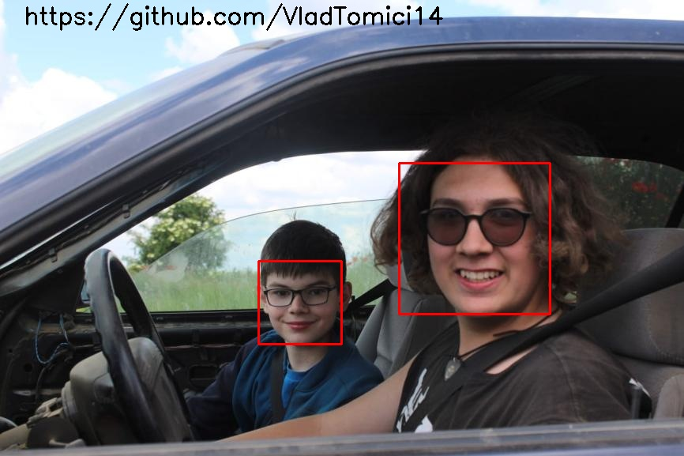
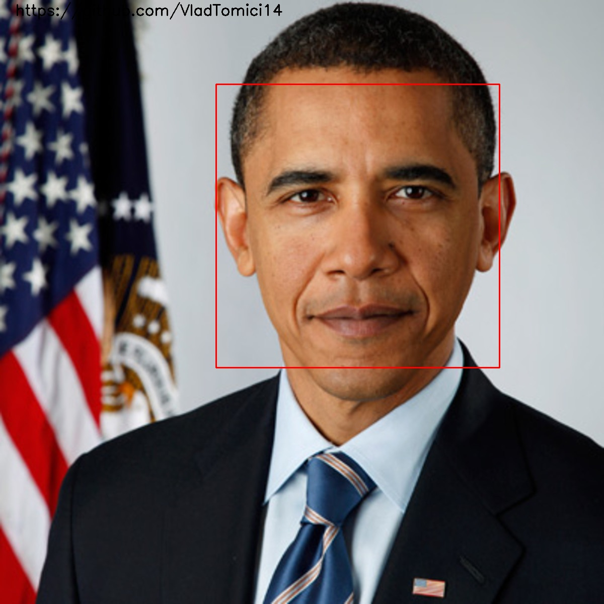
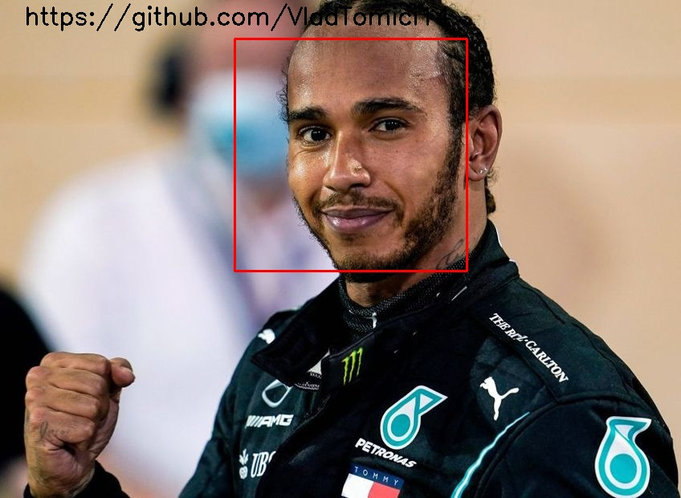
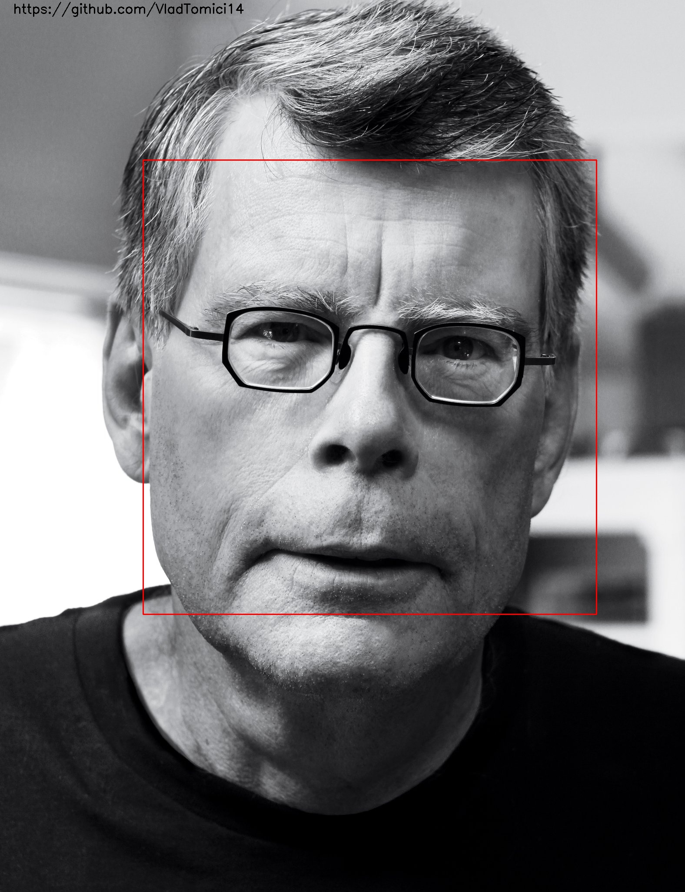

# Face Detection 
Face detection is everywhere in our days: phone cameras, Snapchat filters, self-autonomous cars and the list goes on.

What's the best thing about face detection is that this became so accessible to everyone. 

Using OpenCV, you only need like 40 lines of code to build one face detector, and the results are great. 

It's amazing to see the way that computer vision develops and becomes so easy to use for everyone.

Take a look at some examples where face detection does a great job to detect people's faces:

Check the Youtube [simple face detection demo!](https://youtu.be/c2FWFGIWlik)
